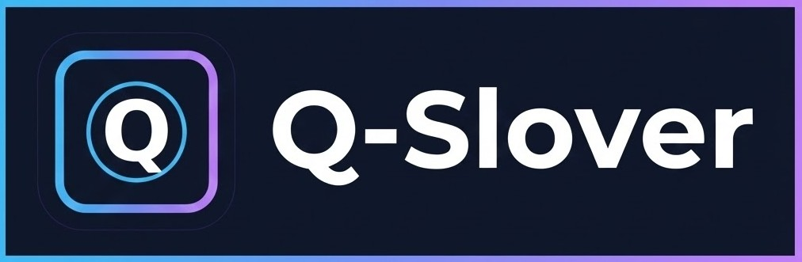
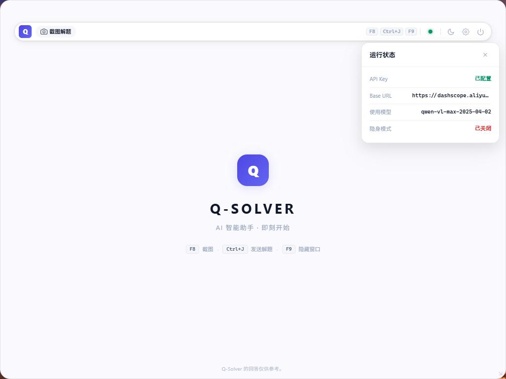
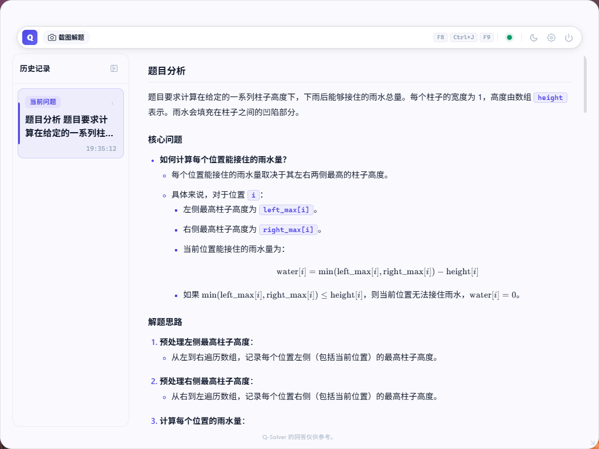

<div align="center">
  

  <h1>Q-Solver</h1>
  <p><strong>AI 答题助手，截图即提问，悬浮即解答。</strong></p>
  <p>一个面向桌面场景的 AI 答题助手。支持隐藏模式、鼠标穿透、不抢焦点，用你自己的 API Key 就能直接开始。</p>

  <p>
    <a href="https://github.com/jym66/Q-solver/stargazers"></a>
    <a href="https://github.com/jym66/Q-solver/releases"></a>
    
    
    
  </p>

  <p>
    
    
  </p>

  <p>
    <a href="README_EN.md">English</a>
  </p>
</div>

---

## 这是什么

Q-Solver 是一个桌面端 AI 做题助手。

你看到题目、代码报错、公式、图表或者英文内容时，不需要再切网页复制粘贴，直接截图就能把内容发送给模型分析。

它的核心特点是：

- 截图即问，适合算法题、笔试题、面试题和代码问题
- 支持隐藏模式，更适合低存在感使用
- 悬浮展示，不抢当前应用焦点
- 支持鼠标穿透，方便挂在屏幕边上随看随用
- 对多数录屏 / 共享场景更不显眼

---

## 五张图看懂 Q-Solver

### 1. 欢迎页与运行状态：打开就知道现在能不能用



- 欢迎页直接告诉你快捷键怎么用
- 右上角状态面板能看到 API Key、Base URL、当前模型和隐藏模式
- 很适合做成一个常驻桌面的 AI 答题助手

### 2. 截图设置：决定你是更要清晰度，还是更要速度


- 支持区域截图和全屏截图
- 可控制是否原图上传，以及压缩质量、锐化、灰度模式
- 让你按题目类型和 token 成本来调节截图策略

### 3. 模型与场景：同一个模型，也能切不同解题风格


- 选择当前要使用的模型
- 切换不同角色 / 场景 prompt
- 让同一张截图输出更贴合当前任务

### 4. API 配置：选择提供商，填入你自己的 Key


- 支持 OpenAI-compatible 接口
- 预设 OpenAI、Google、Anthropic、DeepSeek、Alibaba Cloud、Moonshot、OpenRouter 等提供商
- 选择 `自定义` 时可填写自己的 Base URL

### 5. 结果页：真正适合连续做题和追问的阅读体验



- 左侧历史记录方便回看上一题
- 右侧输出是结构化分析，不是一句简单答案
- 更适合边做题边看思路、公式、代码和关键步骤

---

## 核心功能

- AI 答题助手：截取桌面内容并直接发送给模型分析
- 历史记录：保留最近结果，方便连续查看
- 模型切换：自动拉取当前接口可用模型
- 场景预设：针对不同题型切换不同提示词风格
- API 自定义：支持任意 OpenAI-compatible 服务
- 截图调节：压缩、锐化、灰度、原图上传可配置
- 简历解析：导入 PDF 简历并调用你自己的模型整理为 Markdown
- 桌面浮窗：支持隐藏模式、鼠标穿透、快捷键操作
- 低打扰体验：尽量不抢焦点，适合挂在桌面边缘随时查看

---

## 快速开始

### 方式一：直接下载

前往 [Releases](https://github.com/jym66/Q-solver/releases) 下载对应系统版本。

> [!NOTE]
> macOS 首次运行如果提示无法打开，可执行：
> ```bash
> xattr -cr /Applications/Q-Solver.app
> chmod +x /Applications/Q-Solver.app/Contents/MacOS/Q-Solver
> ```

### 方式二：源码运行

环境要求：

- Go 1.25+
- Node.js 22+
- Wails CLI

```bash
go install github.com/wailsapp/wails/v2/cmd/wails@latest

git clone https://github.com/jym66/Q-solver.git
cd Q-Solver

wails dev
```

构建发布版：

```bash
wails build -ldflags "-s -w" -tags prod
```

---

## 配置方式

第一次使用建议按这个顺序：

1. 打开右上角设置
2. 在 `API` 页面选择模型提供商并填写 `API Key`
3. 如果是自定义兼容接口，再填写 `Base URL`
4. 在 `模型` 页面刷新模型列表并选择一个模型
5. 在 `模型` 页面选择你想使用的场景
6. 在 `截图` 页面按需调整截图参数
7. 回到主界面开始截图解题

---

## 快捷键

默认快捷键如下：

| 动作 | Windows | macOS |
|:---|:---:|:---:|
| 截图 | `F8` | `Cmd + 1` |
| 发送解题 | `Ctrl + J` | `Cmd + J` |
| 显示 / 隐藏窗口 | `F9` | `Cmd + 2` |
| 鼠标穿透 | `F10` | `Cmd + 3` |
| 微调窗口位置 | `Alt + 方向键` | `Cmd + Option + 方向键` |
| 滚动内容 | `Alt + PgUp / PgDn` | `Cmd + Option + Shift + 方向键` |

> macOS 当前使用固定快捷键；Windows 支持在设置中录制和调整。


## 技术栈

- Core: Go
- Desktop Binding: Wails
- Frontend: Vue 3 + Pinia
- LLM Access: OpenAI-compatible API + OpenAI SDK

---

## Star History

<div align="center">
  <a href="https://star-history.com/#jym66/Q-solver&Date">
    
  </a>
</div>

---

## License

本项目采用 **CC BY-NC 4.0** 许可公开源码，仅供非商业个人学习与研究使用。

---

<div align="center">
  <p>如果你喜欢这种“截图即解题”的桌面 AI 工作流，欢迎点一个 Star。</p>
  <p><a href="https://github.com/jym66">jym66</a></p>
</div>
